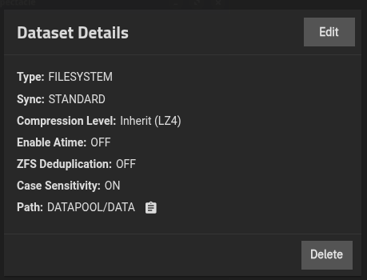
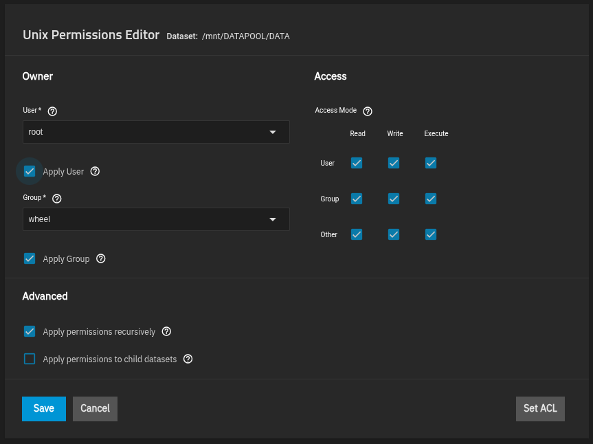
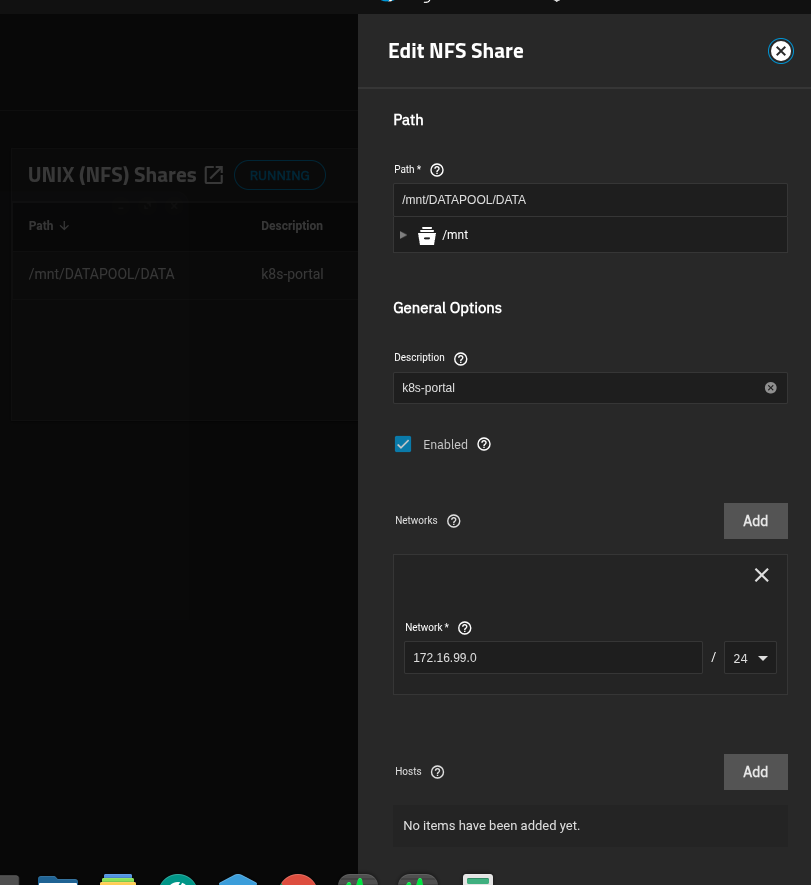
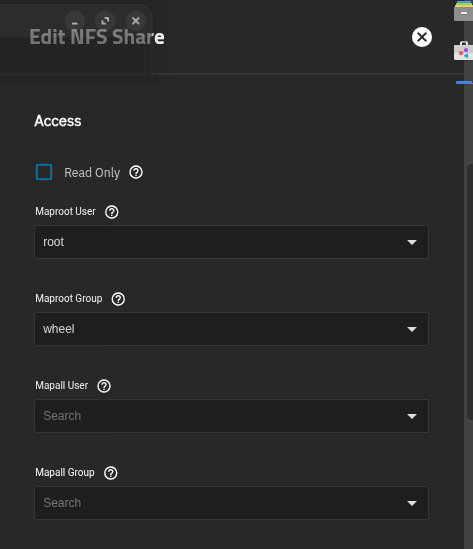
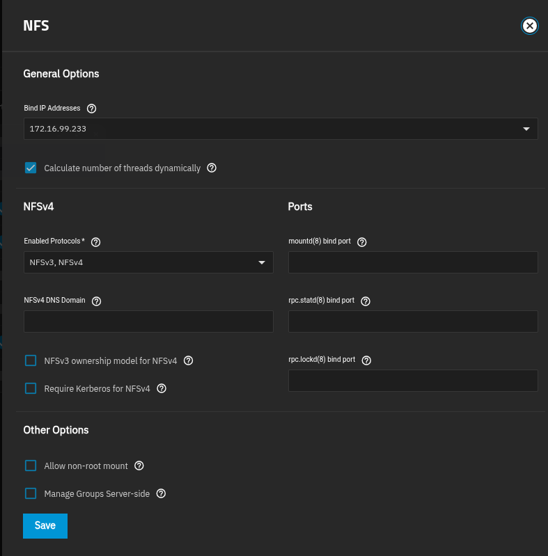

# Almacenamiento persistente - Talos - NFS - Truenas

---

# Integración de TrueNAS como Almacenamiento Persistente NFS en Talos Linux Kubernetes

## Índice

1. [Contexto y Arquitectura](#contexto)
2. [Fase 1: Preparación de los Nodos Talos Linux](#fase-1-preparacion-nodos-talos)
3. [Fase 2: Configuración de TrueNAS](#fase-2-configuracion-truenas)
4. [Fase 3: Instalación y Configuración del Provisioner NFS](#fase-3-instalacion-provisioner-nfs)
5. [Fase 4: Verificación y Pruebas de Funcionamiento](#fase-4-verificacion-pruebas)
6. [Apéndice: Solución de Problemas Comunes](#apendice-solucion-problemas)

---

## 1. Contexto y Arquitectura

### 1.1. Descripción del Entorno

- **Cluster Kubernetes:** 8 máquinas físicas/virtuales corriendo **Talos Linux**.
- **Nodos del Cluster:**
  - `talos01` (IP: `172.16.99.101`): Control Plane.
  - `talos02` a `talos08` (IPs: `172.16.99.102` - `172.16.99.108`): Workers.
- **Almacenamiento Externo:** Servidor **TrueNAS** (IP: `172.16.99.233`).
- **Estación de Administración:** PC `INFRMBM1` (con `talosctl`, `kubectl`, `helm`).

### 1.2. Objetivo Final

Crear un entorno de pruebas donde los contenedores puedan migrar entre nodos sin perder datos, usando TrueNAS como backend de almacenamiento persistente via **NFS**. Por que lo hice de esta manera, pues por que necesito en este minuto aprende a dominiar la plataforma, no solo necesito que los pods vivan en su propio almacenamiento persistente, necesito ademas aprender a migrar los pods y saber reaccionar si uno de los Talos se apaga. 

### 1.3. Resultado: Stack Tecnológico

- **Talos Linux:** v1.12.7 (actualizado).
- **Kubernetes:** v1.35.2.
- **TrueNAS:** API v2.0 funcionando.
- **NFS Provisioner:** `nfs-subdir-external-provisioner`.
- **StorageClass:** `truenas-nfs` (configurada como default).

---

## 2. Fase 1: Preparación de los Nodos Talos Linux

### 2.1. Verificación del Estado Inicial

```bash
kubectl get nodes -o wide
# NAME      STATUS   ROLES           VERSION   OS-IMAGE          KERNEL-VERSION
# talos01   Ready    control-plane    v1.35.2   Talos (v1.12.6)   6.18.18-talos
# talos02   Ready    <none>           v1.35.2   Talos (v1.12.6)   6.18.18-talos
# ... (todos en v1.12.6)
```

### 2.2. Problema: Versión Antigua y Falta de Extensión iSCSI (No Necesaria para NFS)

Inicialmente buscamos usar iSCSI, lo que requería la extensión `iscsi-tools`. Aunque para NFS no es estrictamente necesaria, el proceso de actualización es útil.

### 2.3. Solución: Actualizar Nodos a Talos v1.12.7 con Extensión `iscsi-tools`

**Paso 1: Generar la Imagen Personalizada en Talos Image Factory**

1. Ve a [https://factory.talos.dev/](https://factory.talos.dev/).
2. Selecciona la versión `v1.12.7`.
3. En "System Extensions", añade `siderolabs/iscsi-tools`.
4. Haz clic en "Generate".
5. La página te proporcionará un `schematic ID`. Ejemplo: `06bf04193482bd7000b4e23e017fc918c43c7fd98a312e35e340f62f8018357f` y la imagen del instalador: `factory.talos.dev/metal-installer/<schematic-id>:v1.12.7`.

**Paso 2: Actualizar los Nodos Uno por Uno**

* **Actualizar el Control Plane (`talos01`):**

  ```bash
  talosctl -n 172.16.99.101 upgrade \
    --image factory.talos.dev/metal-installer/06bf04193482bd7000b4e23e017fc918c43c7fd98a312e35e340f62f8018357f:v1.12.7
  ```

  * *Problema Encontrado:* Error `net/http: TLS handshake timeout`.
  * *Causa:* El nodo no tenía salida a Internet o problemas de DNS.
  * *Solución:* Se verificó la configuración de DNS y gateway.
* **Verificación de DNS y Gateway:**

  ```bash
  talosctl -n 172.16.99.101 get resolvers
  # NODE            NAMESPACE   TYPE             ID          VERSION   RESOLVERS            SEARCH DOMAINS
  # 172.16.99.101   network     ResolverStatus   resolvers   3         ["208.67.220.220"]   []

  talosctl -n 172.16.99.101 read /etc/resolv.conf
  # nameserver 127.0.0.53  <--- Error! Apuntaba a localhost.
  ```

  * *Corrección de DNS y Gateway:* Se parcheó la configuración de red.

  ```bash
  # Crear un archivo de parche
  cat > gateway-patch.yaml << EOF
  machine:
    network:
      interfaces:
        - interface: enp1s0
          routes:
            - network: 0.0.0.0/0
              gateway: 172.16.99.1
  EOF

  # Aplicar el parche
  talosctl -n 172.16.99.101 patch machineconfig --patch @gateway-patch.yaml
  talosctl -n 172.16.99.101 reboot
  ```

  * *Verificación Post-Reinicio:*

  ```bash
  talosctl -n 172.16.99.101 read /etc/resolv.conf
  # Ahora debe mostrar los nameservers correctos.
  ```
* **Actualizar Workers (`talos02` a `talos08`):**

  ```bash
  for ip in 172.16.99.102 172.16.99.103 172.16.99.104 172.16.99.105 172.16.99.106 172.16.99.107 172.16.99.108; do
    echo "Actualizando $ip..."
    talosctl -n $ip upgrade \
      --image factory.talos.dev/metal-installer/06bf04193482bd7000b4e23e017fc918c43c7fd98a312e35e340f62f8018357f:v1.12.7
    sleep 90
  done
  ```

**Paso 3: Verificar la Actualización y la Extensión**

```bash
kubectl get nodes -o wide
# Todos los nodos deben mostrar OS-IMAGE: Talos (v1.12.7) y KERNEL-VERSION: 6.18.24-talos

talosctl -n 172.16.99.101 get extensions
# NODE            NAMESPACE   TYPE              ID   VERSION   NAME          VERSION
# 172.16.99.101   runtime     ExtensionStatus   0    1         iscsi-tools   v0.2.0
```

---

## 3. Fase 2: Configuración de TrueNAS

### 3.1. Acceso Inicial

- Interfaz Web: `https://172.16.99.233`
- Usuario/Contraseña: Configurados durante la instalación de TrueNAS.

### 3.2. Problema: Autenticación API Fallida (`401 Unauthorized / Invalid API key`)

* **Síntomas:**

  ```bash
  curl -k -H "Authorization: Bearer MI_API_KEY" https://172.16.99.234/api/v2.0/system/info
  # Invalid API key
  ```
* **Causas y Solución:**

  1. La API Key generada no tenía permisos de administrador o estaba mal copiada.
  2. Se optó por usar **usuario y contraseña** para simplificar la autenticación, o generar una nueva API key con permisos correctos.
  3. Para la solución final con NFS, usamos la API key válida.

### 3.3. Creación de Datasets y Shares en TrueNAS

**Paso 1: Crear los Datasets**

- Ve a `Storage` → `Pools`.
- Selecciona tu pool principal (`DATAPOOL` en este caso).
- Clic en `Add Dataset` y crea:
  - **Nombre:** `DATA` (Tipo: Generic)
  
#### Instrucciones graficas para la creacion del Dataset

<figure>
  
  <figcaption>Creacion del Dataset</figcaption>
</figure> 

**Paso 2 Configurar permisos del Dataset**

#### Seteo de permisos del Dataset

<figure>
  
  <figcaption>Permsisos para el usuario root y grupo wheel sobre el Dataset</figcaption>
</figure>

**Paso 3: Configurar el Share NFS**

- Ve a `Shares` → `Unix (NFS)` → `Add`.
- **Path:** `/mnt/DATAPOOL/DATA`
- **Maproot User:** `root`
- **Maproot Group:** `wheel`
- **Networks:** `172.16.99.0/24` (Permitimos que todo nuestro segmento se pueda conectar al share)
- **Check:** `All dirs` (Crucial para que el provisioner pueda crear subdirectorios).
- Clic en `Save`.

#### Configuracion del Share

<figure>
  
  <figcaption>Creacion y configuracion del share</figcaption>
</figure>

<figure>
  
  <figcaption>Permisos de acceso al share</figcaption>
</figure>


**Paso 4: Configuracion del servicio NFS**

- Ve a `System` → `Services` → `Editamos el servivio NFS`.
- **Bind IP Address:** `172.16.99.233`
- **Enabled Protocols:** `NFSv3, NFSv4`
- ***Todo lo demas queda por defecto:*** .

#### Configuracion del Servicio NFS

<figure>
  
  <figcaption>Configuracion del servicio NFS para escuchar coneciones</figcaption>
</figure>
---

## 4. Fase 3: Instalación y Configuración del Provisioner NFS

*Decisión Clave:* Después de múltiples intentos fallidos con `democratic-csi` (iSCSI y NFS), se decidió usar la solución más simple y robusta: **`nfs-subdir-external-provisioner`**.

### 4.1. Instalación del Provisioner NFS

```bash
# Añadir el repositorio Helm
helm repo add nfs-subdir-external-provisioner https://kubernetes-sigs.github.io/nfs-subdir-external-provisioner/
helm repo update

# Crear el namespace para el provisioner
kubectl create namespace storage

# Instalar
helm install nfs-provisioner nfs-subdir-external-provisioner/nfs-subdir-external-provisioner \
  --namespace nfs-provisioner \
  --set nfs.server=172.16.99.233 \
  --set nfs.path=/mnt/DATAPOOL/DATA \
  --set storageClass.name=truenas-nfs \
  --set storageClass.defaultClass=true \
  --set storageClass.reclaimPolicy=Delete
```

### 4.2. Verificación de la Instalación

```bash
kubectl get pods -n storage
# NAME                                                              READY   STATUS    RESTARTS   AGE
# nfs-provisioner-nfs-subdir-external-provisioner-f7d66b47c-kgvxk   1/1     Running   0          2m

kubectl get storageclass
# NAME                    PROVISIONER                                                     RECLAIMPOLICY   VOLUMEBINDINGMODE   ALLOWVOLUMEEXPANSION   AGE
# truenas-nfs (default)   cluster.local/nfs-provisioner-nfs-subdir-external-provisioner   Delete          Immediate           true                   2m
```

---

## 5. Fase 4: Verificación y Pruebas de Funcionamiento

### 5.1. Crear un PersistentVolumeClaim (PVC) de Prueba

```bash
cat << 'EOF' | kubectl apply -f -
apiVersion: v1
kind: PersistentVolumeClaim
metadata:
  name: test-nfs-nuevo
  namespace: default
spec:
  accessModes:
    - ReadWriteMany
  resources:
    requests:
      storage: 1Gi
  storageClassName: truenas-nfs
EOF

# Verificar que se bindee (debe pasar a Bound en segundos)
kubectl get pvc test-nfs-nuevo -n default -w
# NAME       STATUS   VOLUME                                     CAPACITY   ACCESS MODES   STORAGECLASS   AGE
# test-nfs-nuevo   Bound    pvc-ba4a9967-ef7d-4d13-9245-5f29fc7f5608   1Gi        RWX          truenas-nfs    13s
```

### 5.2. Crear un Pod de Prueba y Verificar Persistencia

```bash
kubectl apply -f - << 'EOF'
apiVersion: v1
kind: Pod
metadata:
  name: test-pod
spec:
  volumes:
    - name: data
      persistentVolumeClaim:
        claimName: test-nfs-nuevo
  containers:
    - name: writer
      image: alpine
      command: ["sh", "-c"]
      args:
        - |
          echo "=== DATOS PERSISTENTES EN NFS ===" > /data/test.txt;
          echo "Creado desde Kubernetes en $(date)" >> /data/test.txt;
          while true; do
            echo "$(date): Escribiendo datos en TrueNAS" >> /data/log.txt;
            sleep 30;
          done
      volumeMounts:
        - name: data
          mountPath: /data
EOF

kubectl get pod test-pod -o wide
# NAME       READY   STATUS    RESTARTS   AGE   IP           NODE
# test-pod   1/1     Running   0          29s   10.244.1.9   talos02

kubectl exec test-pod -- cat /data/test.txt
# === DATOS PERSISTENTES EN NFS ===
# Creado desde Kubernetes en Wed May 13 16:59:52 UTC 2026
```

### 5.3. Prueba de Migración de Contenedor (Objetivo Final)

```bash
# Drenar el nodo donde corre el pod
kubectl drain talos02 --ignore-daemonsets --delete-emptydir-data

# Observar como el pod se reprograma en otro nodo
kubectl get pod test-pod -o wide -w
# test-pod   1/1     Terminating   0          10m   10.244.1.9    talos02
# test-pod   0/1     Pending       0          0s    <none>        talos07
# test-pod   0/1     ContainerCreating   0          0s    <none>        talos07
# test-pod   1/1     Running             0          3s    10.244.7.5    talos07

# Verificar que los datos PERSISTEN después de la migración
kubectl exec test-pod -- tail /data/log.txt
# Wed May 13 16:59:52 UTC 2026: Escribiendo datos en TrueNAS
# Wed May 13 17:00:23 UTC 2026: Escribiendo datos en TrueNAS
# Wed May 13 17:00:53 UTC 2026: Escribiendo datos en TrueNAS

# Reactivar el nodo drenado
kubectl uncordon talos02
```

---

## 6. Apéndice: Solución de Problemas Comunes

| Problema                                         | Síntoma                                           | Solución                                                                                                                  |
| :----------------------------------------------- | :------------------------------------------------- | :------------------------------------------------------------------------------------------------------------------------- |
| **Nodo Talos sin Internet**                | Error`TLS handshake timeout` al hacer upgrade.   | Verificar y parchear el gateway y DNS en la`machineconfig`.                                                              |
| **DNS Interno Incorrecto**                 | `/etc/resolv.conf` apunta a `127.0.0.53`.      | Parchear`machineconfig` para forzar `resolvConf.override: true` y añadir nameservers.                                 |
| **API Key de TrueNAS Inválida**           | `401 Unauthorized / Invalid API key`.            | Generar una nueva API key desde`Settings` con permisos de administrador y copiarla sin errores.                          |
| **`datasetParentName` Incorrecto**       | Error`"Please specify a pool which exists..."`.  | Asegurar que el dataset padre (`DATAPOOL/k8s-portal`) existe en TrueNAS.                                                 |
| **Error `targetGroups is not iterable`** | Pods del CSI en`CrashLoopBackOff`.               | La configuración de iSCSI es compleja. Se recomienda usar NFS.                                                            |
| **Share NFS no accesible**                 | Pods en`ContainerCreating` o errores de montaje. | Verificar que el share NFS en TrueNAS tenga la opción**`All dirs`** habilitada.                                         |
| **Provisioner no inicia**                  | Pods en`CrashLoopBackOff`.                       | Verificar que el servidor NFS (`172.16.99.234`) sea accesible y que el path (`/mnt/DATAPOOL/k8s-portal`) sea correcto. |

---

## Conclusión Final

Se ha  construido con éxito un cluster Kubernetes sobre Talos Linux, integrado con un servidor TrueNAS para proporcionar almacenamiento persistente y dinámico via NFS. Esta solución  permite desplegar aplicaciones stateful y probar la migración de contenedores entre nodos sin pérdida de datos, cumpliendo con el objetivo de tu laboratorio.
