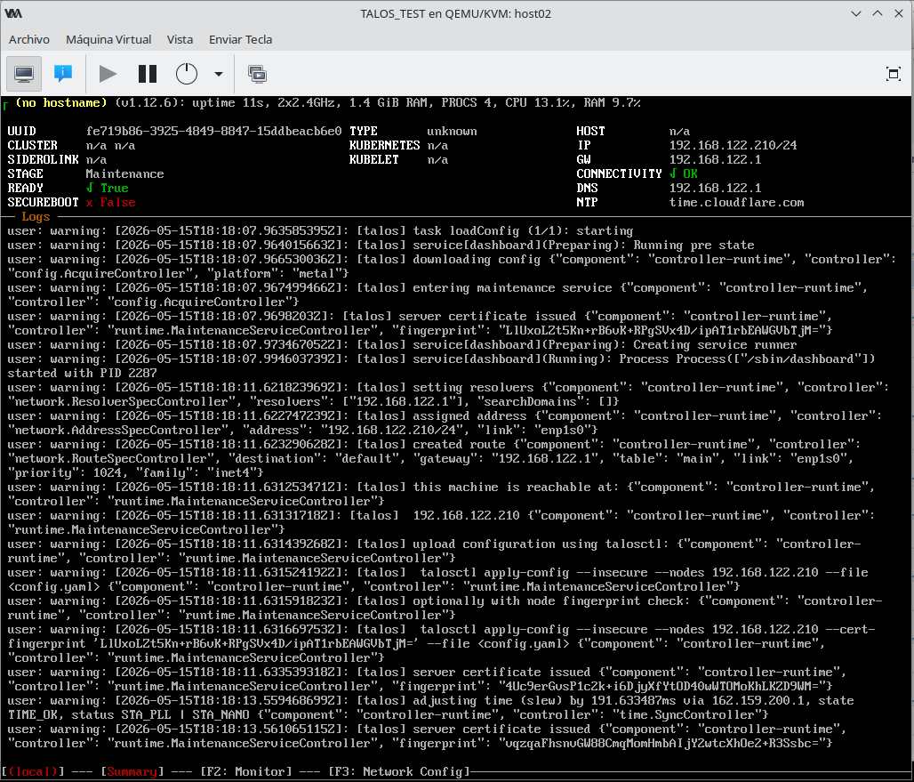
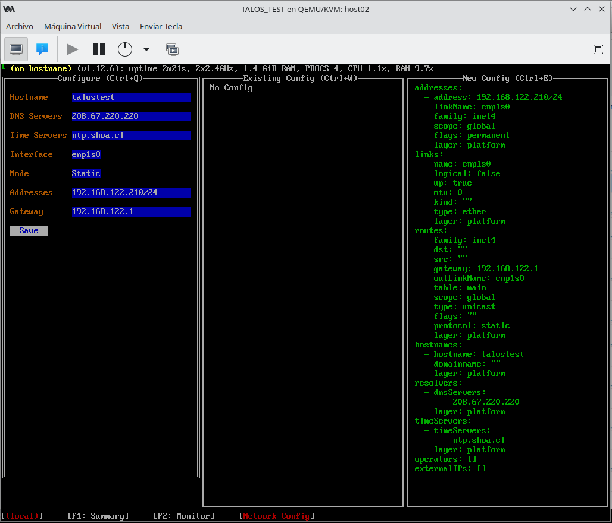
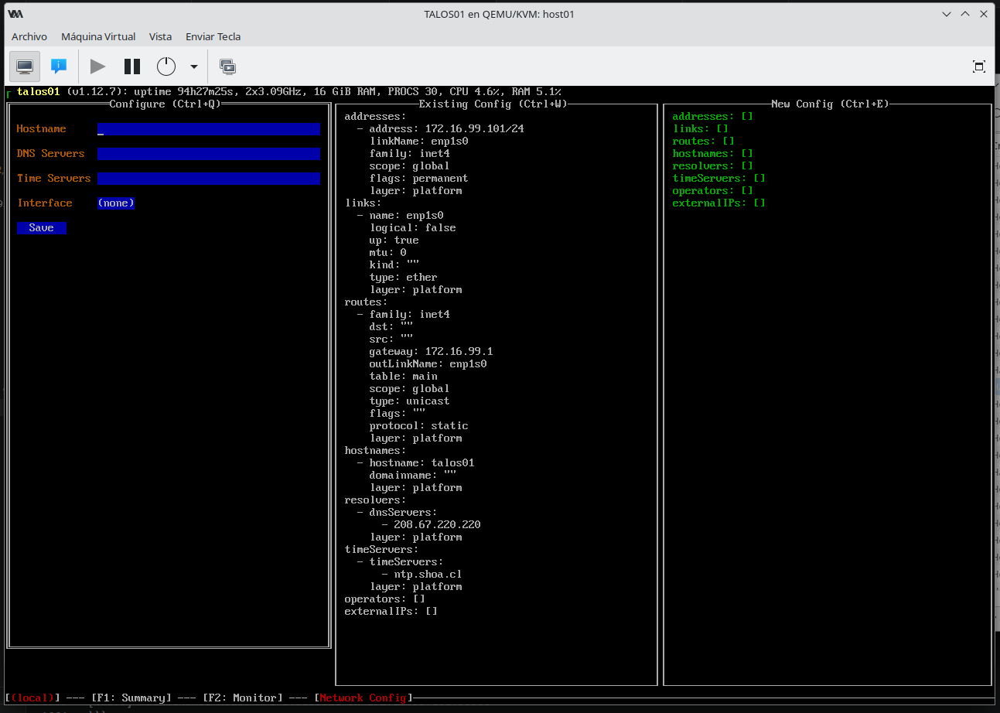

# Implementacion del Cluster

## Descripcion y Objetivo

El presente detalla el proceso de implementacion del Cluster de Talos con 8 Maquinas Virtuales, de las cuales una sera el ControlPlane del Cluster.

El objetivo de esta implementacion es dar vida a recursos de procesamiento que estaban en el basurero y ademas afilar y afinar las habilidaes del autor en todo lo relacionado a Infraestructura, DevOps, Ciberseguridad y DevSecOps.

## I. Arquitectura del Cluster

| VM Name | HOST DE VIRTUALIZACION | ID | UUID                                 | Estado     | CPU(s) | CPU_Time_s | Memoria_Max_MiB | Memoria_Used_MiB | Persistente | Autoinicio |
| ------- | ---------------------- | -- | ------------------------------------ | ---------- | ------ | ---------- | --------------- | ---------------- | ----------- | ---------- |
| TALOS01 | HOST01                 | 10 | 3c3eb3b8-1c2a-4812-9928-2cf83973705d | ejecutando | 2      | 66851,1    | 16500           | 16500            | si          | activar    |
| TALOS02 | HOST02                 | 1  | b9db62ee-cef5-4a84-95b6-fc6884683eeb | ejecutando | 8      | 53428,3    | 16000           | 16000            | si          | desactivar |
| TALOS03 | HOST03                 | 1  | e03f83cd-ad92-4bc7-be08-234a3ee7d9ee | ejecutando | 8      | 54710,2    | 16000           | 16000            | si          | desactivar |
| TALOS04 | HOST04                 | 11 | 52fb2045-086f-46df-b260-94adf40cbb27 | ejecutando | 4      | 41482,7    | 5500            | 5500             | si          | activar    |
| Truenas | HOST04                 | 13 | a8ddaeed-8078-4051-b7ed-469af7792c84 | ejecutando | 2      | 14433,4    | 2048            | 2048             | si          | desactivar |
| TALOS05 | HOST05                 | 1  | 6a2ae31b-4858-41db-89fb-53a20eefa092 | ejecutando | 4      | 43791,2    | 7500            | 7500             | si          | activar    |
| TALOS06 | HOST06                 | 2  | dd30decf-0e73-45fc-bf1a-eef4c331d5d9 | ejecutando | 4      | 43363,2    | 7500            | 7500             | si          | activar    |
| TALOS07 | HOST07                 | 2  | d90c35f6-3be5-4f72-89da-b3a6c0d9bbe8 | ejecutando | 4      | 43553,9    | 7500            | 7500             | si          | activar    |
| TALOS08 | HOST08                 | 2  | ae3f5cbd-3e7c-485b-98a8-23dc406e94a9 | ejecutando | 4      | 44459,9    | 7500            | 7500             | si          | activar    |

**Requisitos de Red:**

- Gateway: `172.16.99.1`
- DNS: `208.67.220.220`
- NTP: `ntp.shoa.cl`, `190.102.231.152`

## 2. Preparación de la Estación de Trabajo (Debian)

### 2.1 Instalar `talosctl`

```bash
# Descargar binario
curl -Lo talosctl https://github.com/siderolabs/talos/releases/latest/download/talosctl-linux-amd64

# Dar permisos y mover al PATH
chmod +x talosctl
sudo mv talosctl /usr/local/bin/

# Verificar versión
talosctl version --client
```

### 2.2 Instalar `kubectl`

```bash
# Descargar kubectl v1.35.2
curl -LO "https://dl.k8s.io/release/v1.35.2/bin/linux/amd64/kubectl"

# Instalar
chmod +x kubectl
sudo mv kubectl /usr/local/bin/

# Verificar
kubectl version --client
```

### 2.3 Crear directorio de trabajo

```bash
mkdir -p ~/Escritorio/TALOS-LAB/talos-master
cd ~/Escritorio/TALOS-LAB/talos-master
```

### *NOTA*

En el entorno KVM, las VM booteadas desde la ISO de Talos arrancan en **modo mantenimiento** (maintenance mode). En ese modo:

- La API está disponible **solo en modo inseguro** (`--insecure`)
- No hay certificados TLS válidos todavía
- `talosctl version` sin `--insecure` Muestra diversos errores

```bash
error getting version: rpc error: code = Unavailable desc = connection error: desc = "transport: authentication handshake failed: tls: failed to verify certificate: x509: certificate signed by unknown authority"
renaico@INFRMBM1:~/Escritorio/TALOS-LAB/talos-master$ talosctl get disk 
rpc error: code = Unavailable desc = connection error: desc = "transport: authentication handshake failed: tls: failed to verify certificate: x509: certificate signed by unknown authority"
renaico@INFRMBM1:~/Escritorio/TALOS-LAB/talos-master$ 
```

## 3 Instalacion de TALOS

### 3.1 Partimos con la implementacion de TALOS booteando las Maquinas virtuales

#### *nota: para no modificar la configuracion productiva de mi laboratorio inicie una nueva maquina virtual para ejemplificar los pasos que deben ser seguidos de forma logica y secuencial para activar la nueva instancia de talos*

<figure>
  
  <figcaption>talos inicia por primera vez en modo mantenimiento</figcaption>
</figure>

#### 3.2 accedemos a la conficuracion de red presionando el menu indicado en la tecla F3

<figure>
  
  <figcaption>Talos durante el proceso de configuracion de red</figcaption>
</figure>

#### 3.2.1 Ejemplo de la configuracion de red en la maquina con el rol de control plane

<figure>
  
  <figcaption>Talos con su red Configurada y Operativa</figcaption>
</figure>

## 4. Configuración del Nodo Master (talos01)

### 4.1 Generar archivos de configuración

```bash
talosctl gen config proliant-cluster https://172.16.99.101:6443 --force
```

Esto genera:

- `controlplane.yaml`
- `worker.yaml`
- `talosconfig`

### 4.2 Verificar tipo de disco con el cual cuenta la maquina, podria considerarse basico y buena practica

```bash
# Ver discos (debe aparecer vda)
talosctl get disks --insecure -n 172.16.99.101
```

### 4.3 Editar `controlplane.yaml`

#### *Considerar revisar el tipo y nomenclatura de la tarjeta de red, la cual variara en funcion del hardware con el cual se cuente.*
#### Editar SOLO lo necesario en `controlplane.yaml`

**Abrir el archivo:**

```bash
nano controlplane.yaml
```

**Cambiá SOLO estas tres secciones** (no toques los certificados ni las claves):

```yaml
machine:
    time:
        disabled: false
        servers:
            - ntp.shoa.cl
            - 190.102.231.152
    network:
        hostname: talos01
        interfaces:
            - interface: eth0        # o enp1s0, según tu VM
              addresses:
                - 172.16.99.101/24
              routes:
                - network: 0.0.0.0/0
                  gateway: 172.16.99.1
    install:
        disk: /dev/vda
```

#### El archivo anterior "controlplane.yaml" se genera de forma automatica cuando se ejecuta el comando (talosctl gen config proliant-cluster https://172.16.99.101:6443 --force). La idea seria Utilizar el generado de forma automatica por talosctl, y editar los parametros de tiempo, red, direccion ip, tipo de disco e interface de red.

## 4.4 Guardar y validar

```bash
# Guardá el archivo (Ctrl+O, Enter, Ctrl+X)
talosctl validate --config controlplane.yaml --mode metal
```

Debería decir: `controlplane.yaml is valid for metal mode` 

## 4.5 Luego aplicá la configuración al host01

**Antes de ejecutar, asegurate de que el servidor ProLiant esté booteado con el USB y muestre la IP en pantalla.**

```bash
talosctl apply-config --insecure --nodes 172.16.99.101 --file controlplane.yaml
```

**Mirá la pantalla del servidor:** debe mostrar que se está instalando en `/dev/vda' 

## 4.6 Después del reinicio (2-3 minutos)

```bash
export TALOSCONFIG=$(pwd)/talosconfig
talosctl config endpoints 172.16.99.101
talosctl config nodes 172.16.99.101
talosctl version
talosctl bootstrap
talosctl dashboard
```

### 4.6.1 Ejemplos de las salidas post Implementacion y aplicacion de bootstrap

``` shell
/Proliant Cluster$ talosctl version
Client:
        Tag:         v1.12.6
        SHA:         a1b8bd61
        Built:       
        Go version:  go1.25.8
        OS/Arch:     linux/amd64
Server:
        NODE:        172.16.99.101
        Tag:         v1.12.7
        SHA:         91c63991
        Built:       
        Go version:  go1.25.9
        OS/Arch:     linux/amd64
        Enabled:     RBAC 

┐ talos01 (v1.12.7): uptime 97h19m54s, 2x3.09GHz, 16 GiB RAM, PROCS 30, CPU 6.8%, RAM 5.1%                                                                                       
                                                                                                                                                                                 
 UUID       3c3eb3b8-1c2a-4812-9928-2cf83973705d                   TYPE               controlplane             HOST         talos01                                              
 CLUSTER    proliant-cluster (8 machines)                          KUBERNETES         v1.35.2                  IP           172.16.99.101/24                                     
 SIDEROLINK n/a                                                    KUBELET            √ Healthy                GW           172.16.99.1, 172.16.99.1                             
 STAGE      √ Running                                              APISERVER          √ Healthy                CONNECTIVITY √ OK                                                 
 READY      √ True                                                 CONTROLLER-MANAGER √ Healthy                DNS          208.67.220.220, 208.67.222.222                       
 SECUREBOOT × False                                                SCHEDULER          √ Healthy                NTP          ntp.shoa.cl, 190.102.231.152                         
── Logs ─────────────────────────────────────────────────────────────────────────────────────────────────────────────────────────────────────────────────────────────────────────
 user: warning: [2026-05-11T19:36:09.658558031Z]: [talos] deleted an image {"component": "controller-runtime", "controller": "runtime.CRIImageGCController", "image":            
 "registry.k8s.io/etcd@sha256:397189418d1a00e500c0605ad18d1baf3b541a1004d768448c367e48071622e5"}                                                                                 
 user: warning: [2026-05-11T19:36:09.683219969Z]: [talos] deleted an image {"component": "controller-runtime", "controller": "runtime.CRIImageGCController", "image":            
 "sha256:397189418d1a00e500c0605ad18d1baf3b541a1004d768448c367e48071622e5"}                                                                                                      
 user: warning: [2026-05-15T19:24:16.538148709Z]: [talos] bootstrap request received                                                                                             
                                                                                                                                                                                 
[172.16.99.101] --- [Summary] --- [F2: Monitor]─

```

## 5 Resumen de comandos (Procurar el orden secuencial)

```bash
# 1. Editar YAML
nano controlplane.yaml

# 2. Validar
talosctl validate --config controlplane.yaml --mode metal

# 3. Instalar
talosctl apply-config --insecure -n 172.16.99.101 --file controlplane.yaml

# 4. Ver logs
talosctl logs --insecure -n 172.16.99.101 -f install

# 5. Después del reinicio (sin --insecure)
export TALOSCONFIG=$(pwd)/talosconfig
talosctl config endpoints 172.16.99.101
talosctl config nodes 172.16.99.101
talosctl version

# 6. Bootstrap
talosctl bootstrap

# 7. Dashboard
talosctl dashboard
