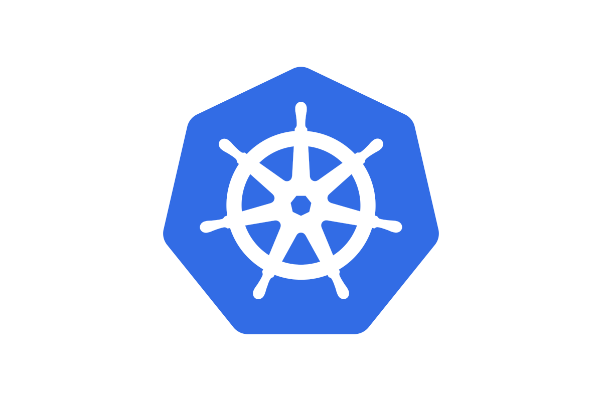

### Descripcion del Documento:
### El presente Documento recopila las indicaciones base para la administracion del cluster 

---

##  1 TALOS CLI - Gestión del Cluster

### 1.1 Configuración Inicial
```bash
# Configurar contexto (primera vez)
export TALOSCONFIG=$(pwd)/talosconfig
talosctl config endpoints 172.16.99.101
talosctl config nodes 172.16.99.101

# Guardar configuración persistentemente
mkdir -p ~/.talos
cp talosconfig ~/.talos/config

# Cargar en nueva terminal
export TALOSCONFIG=~/.talos/config
```

### 1.2 Instalación y Bootstrap
```bash
# Generar archivos de configuración
talosctl gen config proliant-cluster https://172.16.99.101:6443 --force

# Validar YAML
talosctl validate --config controlplane.yaml --mode metal
talosctl validate --config worker.yaml --mode metal

# Instalar nodo (modo mantenimiento)
talosctl apply-config --insecure -n 172.16.99.101 --file controlplane.yaml

# Inicializar clúster
talosctl bootstrap
```

### 1.3 Monitoreo y Diagnóstico

```bash
# Dashboard principal
talosctl dashboard
talosctl dashboard -n 172.16.99.102  # Worker específico

# Servicios del sistema
talosctl services
talosctl services -n 172.16.99.102

# Recursos del nodo
talosctl stats -n 172.16.99.101

# Discos detectados
talosctl get disks -n 172.16.99.101

# Logs de servicios
talosctl logs -n 172.16.99.101 kubelet
talosctl logs -n 172.16.99.102 kubelet
```

### 1.4 Gestión de Nodos

```bash
# Reiniciar nodo
talosctl reboot -n 172.16.99.102

# Resetear nodo (reinstalación completa)
talosctl reset -n 172.16.99.102 --reboot --graceful=false

# Ver versión
talosctl version
```

---

##  2 KUBERNETES CLI - Gestión del Clúster

### 2.1 Configuración Inicial
```bash
# Generar kubeconfig
talosctl kubeconfig .

# Configurar contexto
export KUBECONFIG=$(pwd)/kubeconfig

# Guardar persistentemente
mkdir -p ~/.kube
cp kubeconfig ~/.kube/config-talos

# Cargar en nueva terminal
export KUBECONFIG=~/.kube/config-talos
```

### 2.3 Estado del Clúster

```bash
# Ver nodos
kubectl get nodes
kubectl get nodes -o wide

# Información del clúster
kubectl cluster-info

# Ver versión
kubectl version
```

### 2.4 Pods y Contenedores

```bash
# Pods del sistema
kubectl get pods -n kube-system

# Todos los pods
kubectl get pods --all-namespaces

# Logs de un pod específico
kubectl logs -n kube-system kube-apiserver-talos01

# Uso de recursos
kubectl top nodes
kubectl top pods --all-namespaces
```

### 2.3 Eventos y Diagnóstico
```bash
# Ver eventos ordenados
kubectl get events --all-namespaces --sort-by='.lastTimestamp'

# Detalles de un nodo
kubectl describe node talos02

# Ver eventos en tiempo real
kubectl get events -w
```

### 2.4 Pruebas y Despliegues
```bash
# Crear deployment de prueba
kubectl create deployment hello-world --image=nginx --port=80

# Ver deployments
kubectl get deployments

# Exponer servicio
kubectl expose deployment hello-world --type=NodePort --port=80

# Ver servicios
kubectl get services

# Limpiar prueba
kubectl delete service hello-world
kubectl delete deployment hello-world

# Pod de prueba de red
kubectl run test --image=alpine --rm -it --restart=Never -- ping 172.16.99.101
```

---

##  3 Flujo Rápido por Escenario

### 3.1 Ver estado general del clúster
```bash
export TALOSCONFIG=~/.talos/config
export KUBECONFIG=~/.kube/config-talos
talosctl dashboard
kubectl get nodes -o wide
kubectl get pods --all-namespaces
```

### 3.2 Agregar un nuevo worker
```bash
# 1. Bootear nodo desde ISO
# 2. Aplicar configuración
talosctl apply-config --insecure -n 172.16.99.XXX --file workerYY.yaml
# 3. Verificar unión
kubectl get nodes -w
talosctl services -n 172.16.99.XXX
```

### 3.3 Diagnosticar un nodo problemático
```bash
talosctl services -n 172.16.99.XXX
talosctl logs -n 172.16.99.XXX kubelet
kubectl describe node talosXX
kubectl get events --all-namespaces | grep talosXX
```

---

##  4 Checklist Rápido

| Verificación | Comando |
|--------------|---------|
| Talos conectividad | `talosctl version` |
| Kubernetes API | `kubectl version` |
| Nodos listos | `kubectl get nodes` |
| Pods del sistema | `kubectl get pods -n kube-system` |
| Dashboard Talos | `talosctl dashboard` |